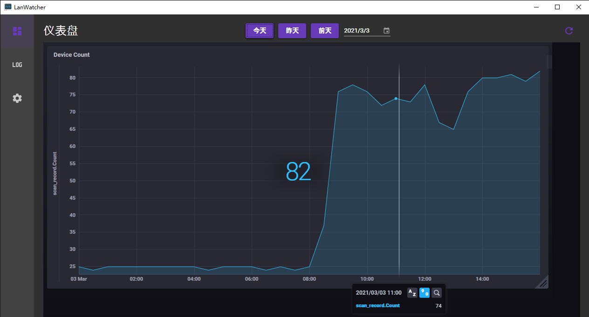
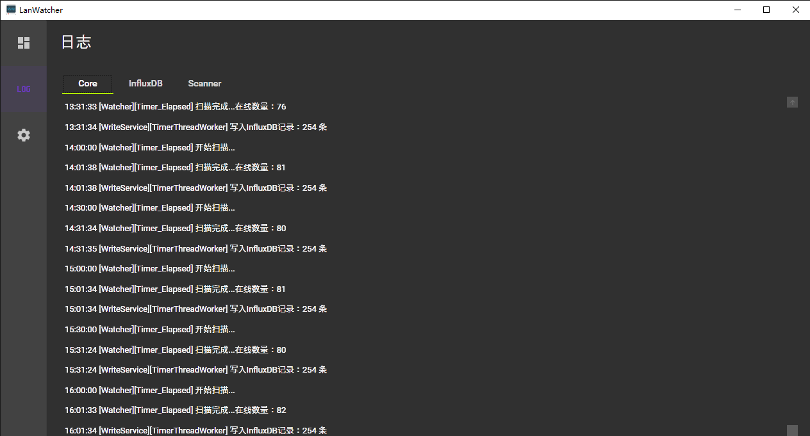
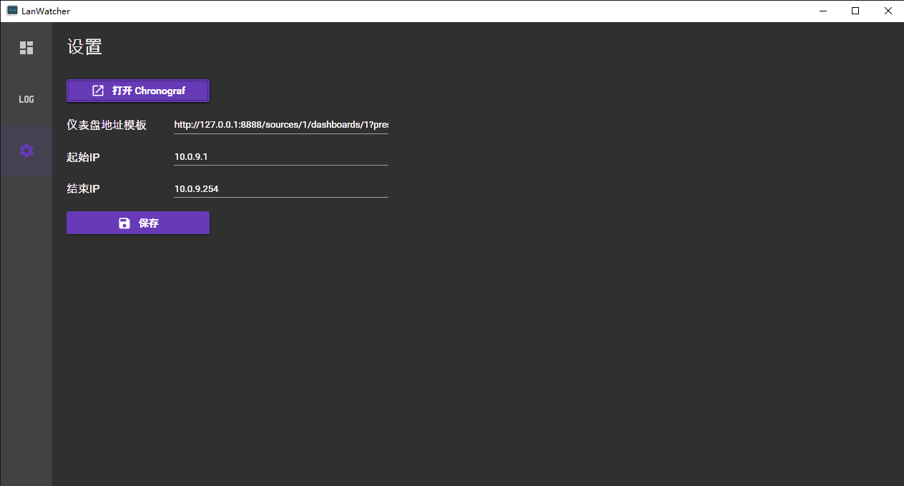

# LanWatcher

## 简介/Introduction

记录并统计局域网内设备的服务

A service which can scan and count online devices over your LAN

通过 `InfluxDB`、`Chronograf` 和 `Advanced IP Scanner v2` 来实现，在运行本软件前，需要下载上述软件并放到指定目录下

This program dependent on `InfluxDB`, `Chronograf` and `Advanced IP Scanner v2`, you should downlaod those software before running this program.

原理是借助了 `InfluxDB`、`Chronograf` 和 `Advanced IP Scanner v2`，在这三个软件的基础上进行了集成。软件自身启动的时候会自动启动 `InfluxDB` 和 `Chronograf`，并且每隔30分钟会运行一次 `Advanced IP Scanner v2`，然后把扫描结果存入 `InfluxDB` 中，通过 `Chronograf` 进行展示

## 截图/Screenshot

## 使用方法/Usage
### Step1.下载依赖软件/Download dependencies
1. [InfluxDB](https://portal.influxdata.com/downloads/)  我使用的版本是 1.7.8，理论上 2.0 以下的版本都可以，2.0 以上的没试过
1. [Chronograf](https://portal.influxdata.com/downloads/) 1.8.10
1. [Advansed IP Scanner v2](http://www.pc6.com/softview/SoftView_93262.html)

### Step2.编译/Compile
1. 打开 LanWatcher.sln，此时你可能会注意到工程中少了一些文件，将上一步中下载的软件复制到对应位置
1. 编译 LanWatcher.UI
1. 编译出的程序在 LanWatcher.UI\bin\\[Debug|Release] 中

### Step3.运行/Run
1. 双击编译后的 LanWatcher.UI.exe
1. 程序启动后会进入后台运行，双击任务栏托盘图标
1. 点击左侧的`设置`按钮
1. 在`起始IP`和`结束IP`中填入你局域网的IP范围
1. 配置完成后，点击左侧的`仪表盘`按钮即可查看当前局域网在线设备数量的图表（如果没有显示出页面，请点击右上角的刷新按钮）

## 其他/Other
软件每隔半小时扫描一次局域网（按30分钟整点算，如6:00会扫描一次，6:30会扫描一次，以此类推），如果你首次打开时无数据，不必担心